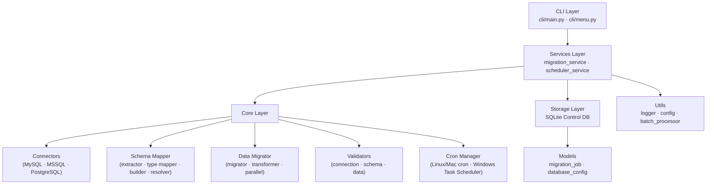

# Universal Database Converter CLI — Implementation Plan

A production-grade, console-based Python 3.11+ application that migrates databases between MySQL, MSSQL, and PostgreSQL with scheduling, parallel processing, resume capability, and structured logging.

---

## Architecture Overview



### Design Principles
- **Clean Architecture** — each layer depends only inward; CLI → Services → Core → Storage
- **Abstract Base Classes** — all connectors inherit `BaseConnector`; easy to extend
- **Dependency Injection** — connectors passed into services, not hard-coded
- **Fail-fast + Resume** — every batch is transactional; `last_processed_id` tracked in SQLite
- **OS-aware scheduling** — cron on Linux/Mac, Windows Task Scheduler on Windows

---

## SQLite Control DB Schema

```sql
CREATE TABLE migration_jobs (
    job_id            TEXT PRIMARY KEY,
    source_engine     TEXT NOT NULL,
    destination_engine TEXT NOT NULL,
    source_host       TEXT NOT NULL,
    source_database   TEXT NOT NULL,
    destination_host  TEXT NOT NULL,
    destination_database TEXT NOT NULL,
    table_name        TEXT NOT NULL,
    total_rows        INTEGER DEFAULT 0,
    converted_rows    INTEGER DEFAULT 0,
    last_processed_id INTEGER DEFAULT 0,
    status            TEXT DEFAULT 'pending',   -- pending|running|paused|completed|failed
    error_message     TEXT,
    created_at        DATETIME DEFAULT CURRENT_TIMESTAMP,
    updated_at        DATETIME DEFAULT CURRENT_TIMESTAMP,
    batch_size        INTEGER DEFAULT 1000
);

CREATE TABLE scheduled_jobs (
    schedule_id   TEXT PRIMARY KEY,
    job_id        TEXT REFERENCES migration_jobs(job_id),
    interval_expr TEXT NOT NULL,   -- cron expression or human interval
    os_job_id     TEXT,            -- cron line hash or Task Scheduler task name
    status        TEXT DEFAULT 'active',  -- active|stopped|deleted
    created_at    DATETIME DEFAULT CURRENT_TIMESTAMP
);
```

---

## Proposed Changes

### Project Root

#### [NEW] [requirements.txt](file:///Volumes/Essentials/Personal%20Projects/database-converter/requirements.txt)
SQLAlchemy, pymysql, pyodbc/mssql driver, psycopg2, click, rich, schedule, python-crontab.

#### [NEW] [pyproject.toml](file:///Volumes/Essentials/Personal%20Projects/database-converter/pyproject.toml)
Project metadata, entry point `db-converter = "cli.main:main"`.

#### [NEW] [.gitignore](file:///Volumes/Essentials/Personal%20Projects/database-converter/.gitignore)
Standard Python ignores + `storage/*.sqlite`, `logs/`.

#### [NEW] [README.md](file:///Volumes/Essentials/Personal%20Projects/database-converter/README.md)
Installation, usage, and architecture docs.

---

### `utils/`

#### [NEW] utils/logger.py
- Creates two file handlers: `logs/migration.log` (INFO+) and `logs/errors.log` (ERROR+)
- Console handler with `Rich` formatting
- `get_logger(name)` factory function

#### [NEW] utils/config.py
- `AppConfig` dataclass: `batch_size`, `max_workers`, `log_level`, `db_path`
- Loads from environment variables with sensible defaults

#### [NEW] utils/batch_processor.py
- `BatchProcessor` — splits iterables into chunks of configurable size
- `stream_query()` — yields rows from a SQLAlchemy connection using `yield_per`

---

### `models/`

#### [NEW] models/database_config.py
```python
@dataclass
class DatabaseConfig:
    engine: str      # mysql | mssql | postgresql
    host: str
    port: int
    username: str
    password: str
    database: str | None = None
    driver: str | None = None   # for ODBC
```

#### [NEW] models/migration_job.py
- SQLAlchemy ORM model mapped to `migration_jobs` table
- `ScheduledJob` ORM model mapped to `scheduled_jobs` table

---

### `storage/`

#### [NEW] storage/control_db.py
- `init_db()` — creates SQLite engine + all tables
- `get_session()` — context manager returning a scoped session
- Singleton pattern for the engine

---

### `core/connectors/`

#### [NEW] core/connectors/base_connector.py
```python
class BaseConnector(ABC):
    @abstractmethod
    def connect(self) -> Engine: ...
    @abstractmethod
    def list_databases(self) -> list[str]: ...
    @abstractmethod
    def get_table_names(self, database: str) -> list[str]: ...
    @abstractmethod
    def get_table_schema(self, database: str, table: str) -> Table: ...
    @abstractmethod
    def get_row_count(self, table: str) -> int: ...
    def test_connection(self) -> bool: ...
```

#### [NEW] core/connectors/mysql_connector.py
- Uses `pymysql` driver via SQLAlchemy URL
- Implements all abstract methods; handles `information_schema` queries

#### [NEW] core/connectors/mssql_connector.py
- Uses `pyodbc` + `mssql+pyodbc` URL
- Queries `sys.tables`, `sys.columns`, `sys.foreign_keys`

#### [NEW] core/connectors/postgresql_connector.py
- Uses `psycopg2` driver
- Queries `information_schema` and `pg_catalog`

#### [NEW] core/connectors/connector_factory.py
- `ConnectorFactory.create(config: DatabaseConfig) -> BaseConnector`
- Maps engine string → connector class; raises `UnsupportedEngineError`

---

### `core/schema_mapper/`

#### [NEW] core/schema_mapper/type_mapper.py
- `TypeMapper` class with a nested dict: `SOURCE_ENGINE → DEST_ENGINE → {type: type}`
- Covers: INT, BIGINT, VARCHAR, TEXT, DATETIME/TIMESTAMP, FLOAT, DECIMAL, BLOB, BOOLEAN, JSON

#### [NEW] core/schema_mapper/schema_extractor.py
- `SchemaExtractor(connector)` — uses SQLAlchemy `inspect()` to get full reflected table metadata
- Returns `TableSchema` objects with columns, PKs, FKs, indexes, constraints

#### [NEW] core/schema_mapper/schema_builder.py
- `SchemaBuilder` — takes `TableSchema` + type map → generates `CREATE TABLE` DDL for target engine
- Handles engine-specific quoting, identity columns (MSSQL), sequences (PostgreSQL)

#### [NEW] core/schema_mapper/dependency_resolver.py
- `DependencyResolver` — builds a directed acyclic graph from FK relationships
- Topological sort (Kahn's algorithm) → returns ordered list of tables for migration

---

### `core/data_migrator/`

#### [NEW] core/data_migrator/row_transformer.py
- `RowTransformer(source_engine, dest_engine)` — converts Python values between engines
- Handles: `datetime` ↔ `str`, `bytes` (BLOBs), `Decimal`, `bool` (0/1 vs True/False)

#### [NEW] core/data_migrator/migrator.py
- `TableMigrator` — migrates a single table:
  1. Get `last_processed_id` from control DB
  2. Stream rows in batches via `BatchProcessor`
  3. Transform each row
  4. Bulk insert in a transaction
  5. Update `converted_rows` + `last_processed_id` after each batch

#### [NEW] core/data_migrator/parallel_migrator.py
- `ParallelMigrator` — uses `ThreadPoolExecutor(max_workers=N)`
- Submits one `TableMigrator` task per table
- Collects futures, reports progress per table

---

### `core/validators/`

#### [NEW] core/validators/connection_validator.py
- `validate_connection(config)` — tries to connect, returns `(ok: bool, error: str)`

#### [NEW] core/validators/schema_validator.py
- `validate_schema_compatibility(source_schema, dest_engine)` — checks all column types are mappable

#### [NEW] core/validators/data_validator.py
- `validate_migration(src_conn, dst_conn, table)`:
  - Compares `COUNT(*)` between source and destination
  - Computes MD5 checksum on a sample of rows
  - Returns `ValidationResult(match: bool, src_count, dst_count, details)`

---

### `core/cron_manager/`

#### [NEW] core/cron_manager/cron_manager.py
- `CronManager(ABC)` → `LinuxCronManager`, `WindowsTaskManager`
- `PlatformCronFactory.create() -> CronManager` — detects `sys.platform`
- Methods: `add_job()`, `list_jobs()`, `remove_job()`, `enable_job()`, `disable_job()`
- Linux/Mac: uses `python-crontab` library
- Windows: calls `schtasks.exe` via `subprocess`

---

### `services/`

#### [NEW] services/migration_service.py
- `MigrationService` — top-level orchestrator:
  1. Validate connections
  2. Discover and list databases
  3. Check destination DB existence
  4. Handle conflict resolution (replace/rename/cancel)
  5. Extract schema → resolve dependencies → build DDL → apply DDL
  6. Run parallel migration
  7. Run post-migration validation
  8. Update job statuses

#### [NEW] services/scheduler_service.py
- `SchedulerService`:
  - `create_scheduled_job(job_id, interval_expr)`
  - `list_scheduled_jobs()`
  - `stop_scheduled_job(schedule_id)`
  - `delete_scheduled_job(schedule_id)`
  - Persists to `scheduled_jobs` table; delegates to `CronManager`

---

### `cli/`

#### [NEW] cli/menu.py
- `Menu` class using `rich` panels and prompts
- Screens: Main Menu, Create Migration, View Jobs, Schedule Job, Stop Job, View Status

#### [NEW] cli/main.py
- Entry point; parses optional CLI args with `argparse`
- Initialises logger, control DB, then launches interactive menu

---

## Verification Plan

### Automated Tests (Import & Init Check)
```bash
cd "/Volumes/Essentials/Personal Projects/database-converter"
pip install -e .
python -c "from cli.main import main; print('CLI import OK')"
python -c "from storage.control_db import init_db; init_db(); print('Control DB OK')"
python -c "from core.connectors.connector_factory import ConnectorFactory; print('Factory OK')"
python -c "from core.schema_mapper.type_mapper import TypeMapper; print('TypeMapper OK')"
python -c "from core.cron_manager.cron_manager import PlatformCronFactory; m=PlatformCronFactory.create(); print('CronManager OK:', type(m).__name__)"
```

### Manual Verification
1. Run `python cli/main.py` — the Rich interactive menu should appear
2. Select **1. Create Migration** — prompts for host/port/user/pass
3. Entering invalid credentials should display a graceful error (no crash)
4. Check `storage/control_db.sqlite` exists after first launch
5. Check `logs/migration.log` is created with startup entries
